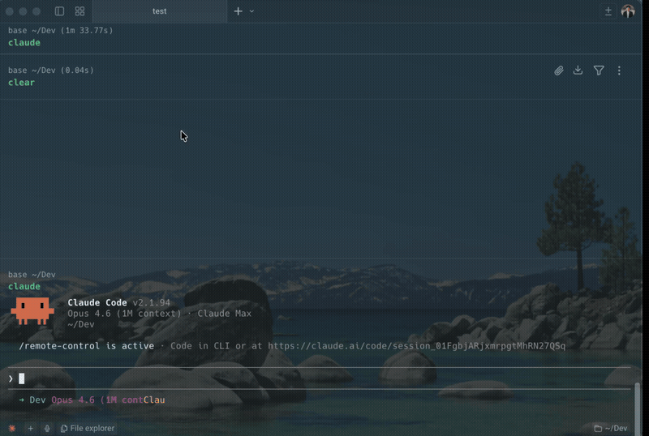

# cc-fit

> Claude works. You get healthy.

A CLI tool that suggests stretches, exercises, hydration breaks, and more during Claude Code's wait time.

Zero dependencies. Works on macOS, Linux, and Windows.



## Why cc-fit?

- Claude Code tasks can take seconds to minutes — you're just staring at the terminal
- Sitting too long, not drinking water, skipping movement — **the classic engineer health trap**
- cc-fit turns AI wait time into body maintenance time

## Setup

```bash
npm install -g cc-fit
cc-fit init
```

That's it. Claude Code hooks are configured automatically.

## How it works

After setup, cc-fit runs automatically:

1. You send a prompt to Claude Code
2. After 10 seconds, a desktop notification suggests an activity
3. Every 30 seconds, another suggestion follows
4. When Claude Code finishes, the timer stops

### Default activities

```
$ cc-fit categories

[Stretch] (stretch)
  - Shoulder rolls x10
  - Neck stretch (10s each side)
  - Reach for the sky and hold 10s
  ...

[Exercise] (exercise)
  - Squats x10
  - Push-ups x5
  - Plank 30s
  ...

[Hydration] (hydration)
  - Drink a glass of water
  ...

[Eyes] (eyes)
  - Look out the window for 20s (20-20-20 rule)
  ...

[Breathing] (breathing)
  - 3 deep breaths
  ...

[Posture] (posture)
  - Sit up straight, reset your posture
  ...
```

## Commands

| Command | Description |
|---|---|
| `cc-fit init` | Set up Claude Code hooks automatically |
| `cc-fit config` | Show current configuration |
| `cc-fit categories` | List activity categories |
| `cc-fit disable` | Temporarily disable notifications |
| `cc-fit enable` | Re-enable notifications |
| `cc-fit uninstall` | Remove hooks from Claude Code settings |

## Configuration

Config file: `~/.cc-fit/config.json`

```json
{
  "enabled": true,
  "timings": [10],
  "intervalSec": 30,
  "debounceSec": 5,
  "say": false
}
```

| Option | Description | Default |
|---|---|---|
| `timings` | Seconds before first notification | `[10]` |
| `intervalSec` | Seconds between notifications | `30` |
| `debounceSec` | Debounce after Claude stops (prevents false stops) | `5` |
| `say` | Read activity aloud using macOS `say` command | `false` |
| `activities` | Custom activity categories and items | Built-in presets |

### Text-to-speech (macOS only)

```json
{
  "say": true
}
```

When enabled, activities are read aloud alongside the desktop notification.

## Architecture

cc-fit uses Claude Code [Hooks](https://docs.anthropic.com/en/docs/claude-code/hooks):

- `UserPromptSubmit` — starts the timer when you send a prompt
- `Stop` — stops the timer when Claude finishes (with 5s debounce)
- `Notification` — stops the timer when Claude needs input

The timer runs as a detached background process — zero impact on Claude Code performance.

## Platform support

| OS | Notification method | Built-in |
|---|---|---|
| macOS | `osascript` | Yes |
| Linux | `notify-send` | Usually yes |
| Windows | PowerShell toast | Yes |

## Activity log

All notifications are logged to `~/.cc-fit/log.jsonl`:

```jsonl
{"timestamp":"2026-04-08T00:21:00.331Z","category":"exercise","activity":"Squats x10"}
{"timestamp":"2026-04-08T00:21:30.468Z","category":"eyes","activity":"Look out the window for 20s"}
```

## License

MIT
